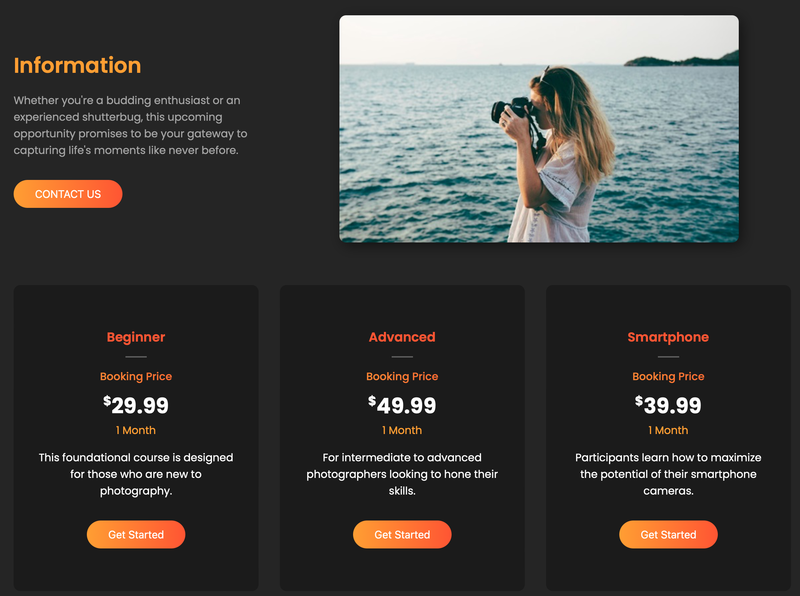

# Pixel Expert Photography

## Introduction

Welcome to Pixel Expert, an online platform offering exclusive photography courses to help enthusiasts and professionals enhance their skills. This project is built using HTML, CSS, and JavaScript. Below, you'll find essential information.

- Deployed Site: https://pixelexpert.tech/
- Final Project Blog Article: [Blog](#)
- Author : [LinkedIn Profile](https://www.linkedin.com/in/zakaria-rassili/)

## Key Features

**- Responsive Design:** A mobile-friendly website ensuring an optimal viewing experience across various devices.

**- Countdown Timer:** Displaying the time remaining until the start of the photography course in hours, minutes, and seconds.

**- Smooth Animations:** Integration of the Scroll Reveal library to create seamless and captivating animations as users navigate through the content.

**- User-Friendly Interface:** A beautiful and pleasant interface crafted to enhance the user experience.

## Contributing

If you're interested in contributing to the project, we welcome your ideas and enhancements. Follow these steps to contribute:

**1- Fork the Repository:** Create your own fork of the Pixel Expert repository.

**2- Create a New Branch:** Develop your feature or bug fix in a new branch for clear version control.

**3- Make Changes and Commit:** Implement your changes and commit them with descriptive messages for better collaboration.

**4- Push Changes to Your Fork:** Push your committed changes to your fork of the repository.

**5- Submit a Pull Request:** Open a pull request to propose your changes for review and integration into the main project.

## Licensing

This project is licensed under the MIT License - see the [LICENSE](LICENSE) file for details.